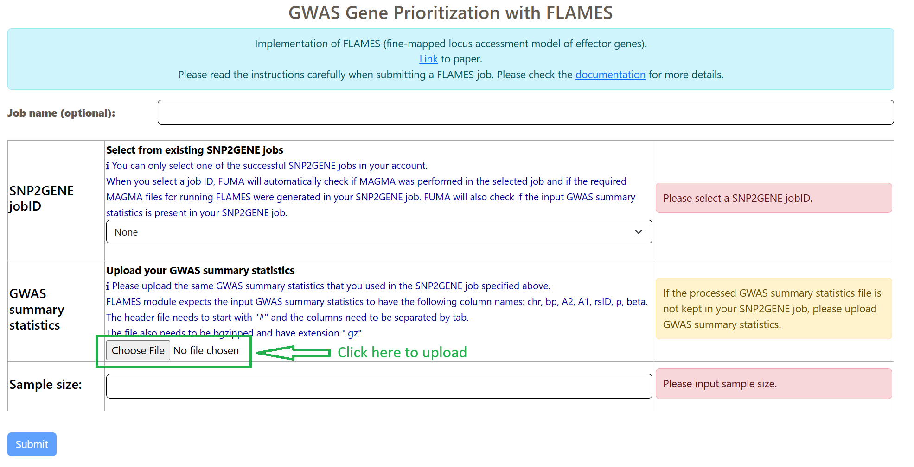

Prepare Input Files
===================

.. _prepare_input_file:

GWAS summary statistics
++++++++++++++++++++++++++

- If you wish to run FLAMES but you did not select the option to keep the input GWAS sumstat (and intermediate files) on FUMA, you can upload the input GWAS summary statistcs in this section: 

- Note that this is the same summary statistics file that you used for SNP2GENE analysis.

- Formatting instructions: 

    1. The file has to have the following columns in this specific order: CHR, BP, A2, A1, RSID, P, BETA. 
    2. The header has to start with "#"
    3. The file has to be bgzip

    .. code-block:: bash
        
        bgzip -c {input} > {input}.gz #replace with the path to the GWAS summary statistics

.. warning::
    IMPORTANT: make sure to format the input GWAS summary statistics correctly prior to uploading to the SNP2GENE module in order for FLAMES to run correctly. Otherwise, your job will return an error. 