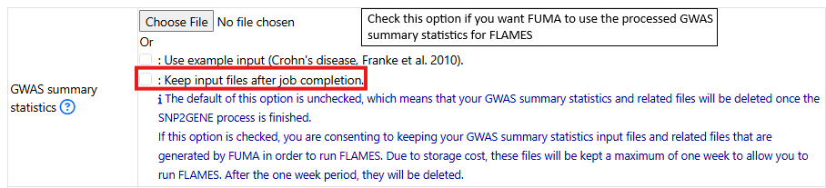
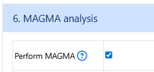
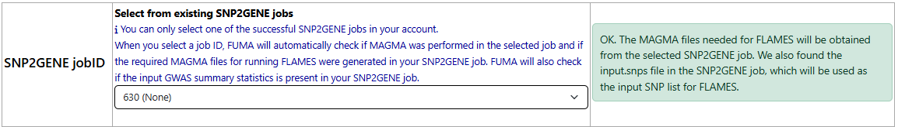
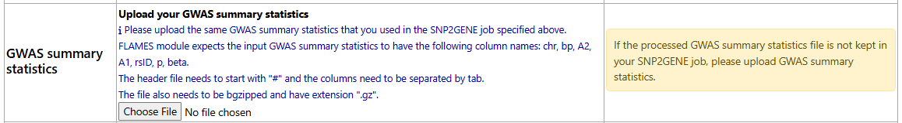

Quick start
===========

To run a successful FLAMES job on FUMA, follow the following steps: 

1. Submit a SNP2GENE job
- Click on a checkbox to keep the processed input GWAS summary statistics. Note that by checking this box, you consent to having your input gwas summary statistics and its processed files stored on the FUMA server for 7 days: 

- Before upload your input gwas summary statistics, in addition to the minimum columns that are needed for SNP2GENE, a required column for FLAMES is beta.
    - remove all other columns that are not needed
    - in FLAMES implementation in FUMA, it will check if the processed input gwas summary statistics has a valid header. The valid header is: "chr", "bp", "non_effect_allele", "effect_allele", "rsID", "p", "beta". The processed input gwas summary statistics is generated by SNP2GENE and will have these headers if your input gwas summary statitics contains: 
        - variant identifier: chromosome, position, rsID, ref, alt. Not all columns are required so some valid combinations are (the list below is not exclusive): 
            - chromosome, position
            - chromosome, position, ref
            - chromosome, position, alt
            - chromosome, position, ref, alt
            - rsID
            - rsID, ref
            - rsID, alt
            - rsID, ref, alt
        - p values
        - beta

- Click on option to run MAGMA. MAGMA is unchecked by default so make sure that MAGMA is checked in your SNP2GENE job.

- Once your SNP2GENE job finishes successfully, you can submit a FLAMES job.

2. Submit a FLAMES job
- From the dropdown of the available SNP2GENE jobs, select your successful SNP2GENE jobs. Assuming that you had followed step 1, all of the required files including the processed input gwas summary statistics are present in your SNP2GENE job. You will see a message like this: 

- When you see this green message, you can skip the next section titled "GWAS summary statistics". 

3. Put in a value for the sample size
- This is a mandatory parameter. You are not allowed to submit the job if this is not filled in. 

4. Click on Submit button 

5. Other notes
- In Step 2, if you select a SNP2GENE job where the optional processed input gwas sumamry statistics is not kept in your SNP2GENE job, you will need to upload your own in the section titled "GWAS summary statistics": 

- To make sure that your input gwas summary statistics is correctly formatted, check :ref:`prepare_input_file` section.