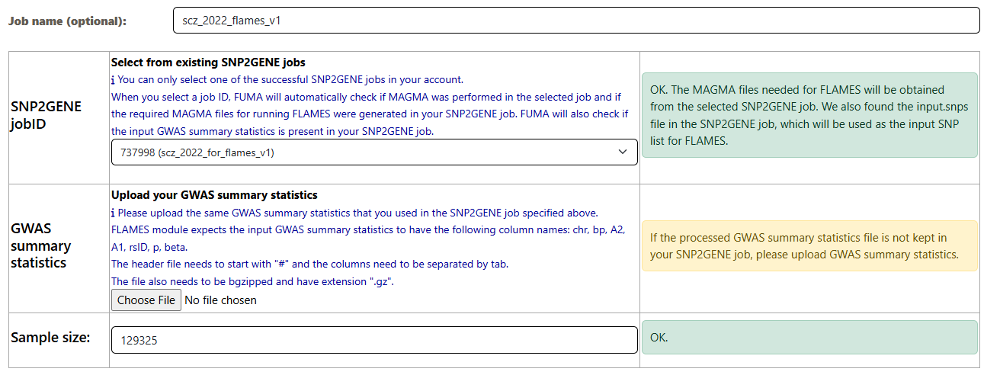
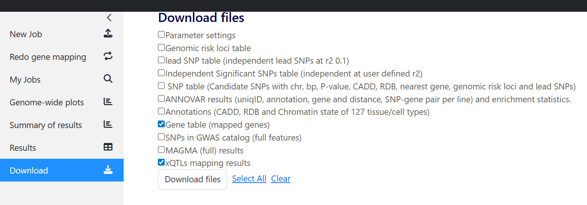
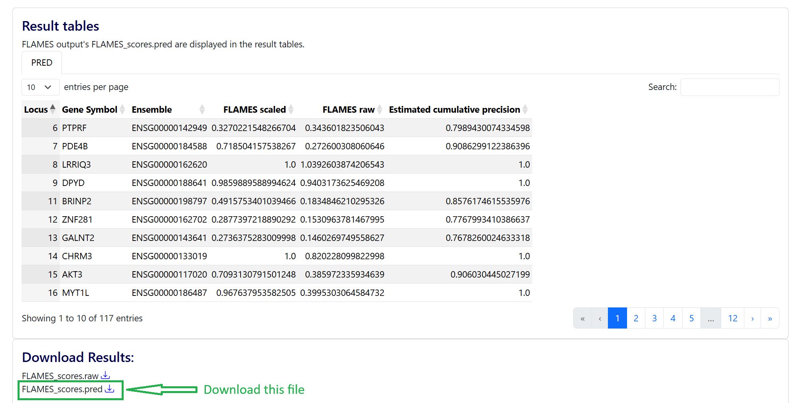
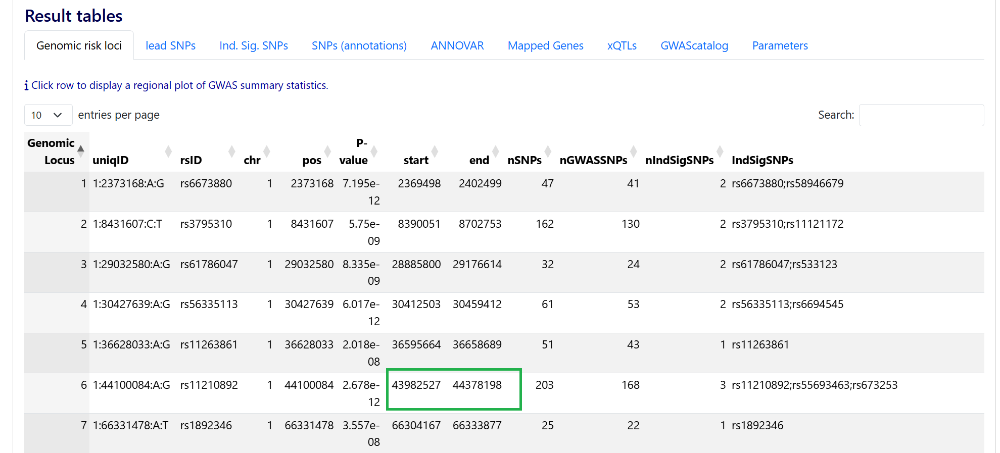

Practicals on SCZ GWAS 2022
===========================

Overview
--------
In this practicals, we are going to analyze the GWAS from Schizophrenia 2022 to showcase how to use the new modules from FUMA v2.0.0

Download and Format  GWAS
-------------------------

- Download the GWAS summary statistics for the Schizophrenia GWAS from 2022 (https://pubmed.ncbi.nlm.nih.gov/35396580/) from https://pgc.unc.edu/for-researchers/download-results/
- Download the file `PGC3_SCZ_wave3.european.autosome.public.v3.vcf.tsv.gz`

.. tip:: 
    ALWAYS inspect the GWAS summary statistics file and format it before submitting to FUMA

- Use `zless PGC3_SCZ_wave3.european.autosome.public.v3.vcf.tsv.gz` to view the content of the file. You will see that the file contains many lines with the `#` symbol before the actual data: 

.. image:: scz_2022_sumstat.png
   :width: 800

1. Check which build, GRCh37 or GRCh38

- Spot check a few variants on gnomad, the chromosome and position matches with GRCh37. For example: 
    - https://gnomad.broadinstitute.org/variant/8-101592213-C-T?dataset=gnomad_r2_1
    - https://gnomad.broadinstitute.org/variant/8-109954636-T-C?dataset=gnomad_r2_1

2. Check which alleles are reference vs alternate

- From the image above, it says A1 is the SNP reference allele and A2 is the SNP alternate allele. This matches with the information from gnomad as well. 

3. Check other columns

- p value is found under column name `PVAL`

- beta is found under column name `BETA`

- Sample sizes: there are 3 columns for sample size in this file: `NCAS`, `NCON`, and `NEFF`. For this practicals, I will define the sample size as equal to the sum of  `NCAS` and `NCON`.

- `FCAS` and `FCON` are the frequency of A1 in cases and controls, respectively. 

4. Let's prepare the input GWAS sumstat for running SNP2GENE and FLAMES. 

- For simplicity, I will prepare the input GWAS sumstat for running FLAMES, which I will also use for running a standard SNP2GENE analysis

- Follow the instruction in https://fuma-docs.readthedocs.io/en/latest/flames/quick_start.html#submit-a-snp2gene-job

- Based on the instruction, I will subset the file `PGC3_SCZ_wave3.european.autosome.public.v3.vcf.tsv.gz` to contain the following columns: `CHROM`, `ID`, `POS`, `A1`, `A2`, `BETA`, and `PVAL`. Example codes: 

.. code-block:: python
    
    import gzip

    outfile = open("scz2022_sumstat_fuma.txt", "w")

    with gzip.open("PGC3_SCZ_wave3.european.autosome.public.v3.vcf.tsv.gz", "rt") as f:
        for line in f:
            if line.startswith("#"):
                continue
            fields = line.strip().split("\t")
            chrom = fields[0]
            pos = fields[2]
            id = fields[1]
            a1 = fields[3]
            a2 = fields[4]
            beta = fields[8]
            pval = fields[10]
            print("\t".join([chrom, id, pos, a1, a2, beta, pval]), file=outfile)

Run FLAMES
----------
- In this section we will try to identify the effect genes by running FLAMES

Step 1. Run SNP2GENE with MAGMA
^^^^^^^^^^^^^^^^^^^^^^^^^^^^^^^

- Submit a SNP2GENE job

    - Make sure to click on the button to keep the input gwas sumstat file for easy implementation of FLAMES
    .. image:: scz_2022_upload.png
        :width: 800

    - Make sure to put in an integer value for the sample size
    .. image:: scz_2022_samplesize.png
        :width: 800

    - Section 3-5 can be left as default

    - Make sure to check MAGMA in section 6
    .. image:: scz_2022_magma.png
        :width: 800

    - Put in a title and submit
    .. image:: scz_2022_submit.png
        :width: 800

    - Job finished successfully: 
    .. image:: scz_2022_snp2gene_for_flame_ok.png
        :width: 800

Step 2. Submit a FLAMES job
^^^^^^^^^^^^^^^^^^^^^^^^^^^

Run a SNP2GENE job with xQTLs mapping
-------------------------------------
- In this section we will run a SNP2GENE job with xQTLs mapping

- In theory, you can combine this with the run for FLAMES. However, it could be the case that MAGMA take a long time. Because each job has a limit of 8 hours, I recommend to run the MAGMA job separately. 

Step 1. Submit a SNP2GENE job
^^^^^^^^^^^^^^^^^^^^^^^^^^^^^
- Make sure to leave the button to keep the input gwas sumstat file **UNCHECKED** (this is the default)

- In step 3, click on **Perform xQTLs Mapping** to expand the options and select the datasets
    - Because I know apriori that schizophrenia is a brain related phenotype, I will select brain related xQTLs datasets
        - eQTLs from the brain
        .. image:: scz_2022_brain_eqtls.png
            :width: 800

        - sQTLs from the brain
        .. image:: scz_2022_brain_sqtls.png
            :width: 800

        - pQTLs from the brain
        .. image:: scz_2022_brain_pqtls.png
            :width: 800

        - sceQTLs from the brain
        .. image:: scz_2022_brain_sceqtls.png
            :width: 800

Analysis: Find predicted relevant genes per genomic risk locus
--------------------------------------------------------------
- In this section, we are going to perform follow-up analyses after: 
    - running a SNP2GENE job to map genes using positional mapping and xQTLs mapping
    - running a FLAMES job which predicts an effector gene per genomic risk locus
- We are interested in: which genes are predicted as being relevant for our GWAS when using:
    - positional mapping
    - xQTLs mapping
    - FLAMES

1. Download the result files from SNP2GENE
- Download `Gene table (mapped genes)` and `xQTLs mapping results`

- Then, unzip the folder

2. Download the result file from FLAMES

3. Create a directory called `scz_2022` and copy and renames these files 

.. code-block:: bash
    

    mv genes.txt scz_2022/positional_mapped_genes.txt
    mv mv xqtls.txt scz_2022/xqtls_mapped_genes.txt
    mv FLAMES_scores_fmt.pred scz_2022/flames_mapped_genes.txt

- Then, run script `list_predicted_genes_per_locus.py`

.. code-block:: bash

    python list_predicted_genes_per_locus.py --filedir scz_2022/

- The above script returns: 
    - column 1: genomic risk locus
    - column 2: whether it is positional (for positional mapping), xqtls (for xqtls mapping), or flames
    - column 3: the predicted or relevant gene
    - column 4: only in the xqtls mapping, it returns the name of the datasets

.. tip:: 
    Analyze each genomic risk locus one at a time

4. Example from genomic risk locus 6

- 3 genes were mapped using positional mapping: 

.. code-block:: bash

    awk -F "," '$1==6{print}' mapped_genes.txt | grep positional
    6,positional,PTPRF,
    6,positional,KDM4A,
    6,positional,ST3GAL3,

- 18 genes where the GWAS hits were also xQTLs: 

.. code-block:: bash

    awk -F "," '$1==6{print}' mapped_genes.txt | grep xqtls | awk -F "," '{print$3}' | sort | uniq
    ARTN
    ATP6V0B
    CCDC24
    CDC20
    DPH2
    ERI3
    FAM183A
    HYI
    IPO13
    KDM4A
    MED8
    PPIH
    PTPRF
    ST3GAL3
    SZT2
    TIE1
    TMEM125
    YBX1

- FLAMES predicted `PTPRF` to be the effector gene

.. code-block:: bash

    awk -F "," '$1==6{print}' mapped_genes.txt | grep flames
    6,flames,PTPRF,

5. We then can run an QTLs Analysis module on FUMA to gain additional insights on the effects of GWAS variants within genomic risk locus 6

Example running QTLs Analysis 
^^^^^^^^^^^^^^^^^^^^^^^^^^^^^

1. Obtain the range for genomic risk locus 6
- You can obtain this from the Results table, under tab `Genomic risk loci`: 

- the range is chr1:43982527-44378198

2. Subset the GWAS sumstat for this range
- For illustration purpose, let's use `FCON` as the MAF
- Example code: 

.. code-block:: bash

    import gzip

    outfile = open("scz2022_sumstat_fuma.txt", "w")

    with gzip.open("PGC3_SCZ_wave3.european.autosome.public.v3.vcf.tsv.gz", "rt") as f:
        for line in f:
            if line.startswith("#"):
                continue
            fields = line.strip().split("\t")
            chrom = fields[0]
            pos = fields[2]
            id = fields[1]
            a1 = fields[3]
            a2 = fields[4]
            beta = fields[8]
            pval = fields[10]
            print("\t".join([chrom, id, pos, a1, a2, beta, pval]), file=outfile)

3. Submit a QTLs Analysis job for genomic risk locus 6
- We can use the results from the `xQTLs mapping` to inform our selection of datasets. For example: 

.. code-block:: bash

    eQTL:gtex_v10:Brain_Cerebellar_Hemisphere
    eQTL:gtex_v10:Brain_Cerebellum
    eQTL:gtex_v10:Brain_Cortex
    eQTL:gtex_v10:Brain_Frontal_Cortex_BA9
    eQTL:metabrain:Brain_cerebellum
    eQTL:metabrain:Brain_cortex
    sceQTL:brainscope:Brain_brainscope_L2.3.IT
    sceQTL:bryois2022Brain:Brain_bryois2022Brain_Astrocytes
    sceQTL:bryois2022Brain:Brain_bryois2022Brain_Endothelial.cells
    sceQTL:bryois2022Brain:Brain_bryois2022Brain_Excitatory.neurons
    sceQTL:bryois2022Brain:Brain_bryois2022Brain_OPCs
    sceQTL:jerber2021Dopaminergic:Brain_jerber2021Dopaminergic_D11.FPP
    sceQTL:jerber2021Dopaminergic:Brain_jerber2021Dopaminergic_D11.P_FPP
    sceQTL:jerber2021Dopaminergic:Brain_jerber2021Dopaminergic_D30.DA
    sceQTL:jerber2021Dopaminergic:Brain_jerber2021Dopaminergic_D30.Epen1
    sceQTL:jerber2021Dopaminergic:Brain_jerber2021Dopaminergic_D30.FPP
    sceQTL:jerber2021Dopaminergic:Brain_jerber2021Dopaminergic_D30.Sert
    sceQTL:jerber2021Dopaminergic:Brain_jerber2021Dopaminergic_D52.Epen1.ROT_treated
    sceQTL:jerber2021Dopaminergic:Brain_jerber2021Dopaminergic_D52.Epen1.untreated
    sceQTL:jerber2021Dopaminergic:Brain_jerber2021Dopaminergic_D52.Sert.ROT_treated
    sceQTL:jerber2021Dopaminergic:Brain_jerber2021Dopaminergic_D52.Sert.untreated
    sceQTL:jerber2021Dopaminergic:Brain_jerber2021Dopaminergic_D52.pseudobulk.untreated
    sceQTL:singlebrain:Brain_singlebrain_Ast
    sceQTL:singlebrain:Brain_singlebrain_Ext3
    sceQTL:singlebrain:Brain_singlebrain_Ext5
    sceQTL:singlebrain:Brain_singlebrain_Ext7
    sceQTL:singlebrain:Brain_singlebrain_MG2
    sceQTL:singlebrain:Brain_singlebrain_MiGA3

- Note that the datasets from single brain can only be implemented with LAVA currently.

- Submit a FLAMES job: 

    .. image:: scz_2022_locus6_qtlsAnalysis.png
    :width: 800