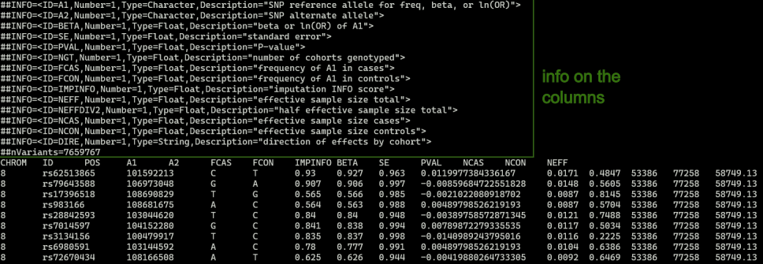

Practicals on SCZ GWAS 2022
===========================

Overview
--------
In this practicals, we are going to analyze the GWAS from Schizophrenia 2022 to showcase how to use the new modules from FUMA v2.0.0

Download and Format  GWAS
-------------------------

- Download the GWAS summary statistics for the Schizophrenia GWAS from 2022 (https://pubmed.ncbi.nlm.nih.gov/35396580/) from https://pgc.unc.edu/for-researchers/download-results/
- Download the file `PGC3_SCZ_wave3.european.autosome.public.v3.vcf.tsv.gz`

.. tip:: 
    ALWAYS inspect the GWAS summary statistics file and format it before submitting to FUMA

- Use `zless PGC3_SCZ_wave3.european.autosome.public.v3.vcf.tsv.gz` to view the content of the file. You will see that the file contains many lines with the `#` symbol before the actual data: 

1. Check which build, GRCh37 or GRCh38
- Spot check a few variants on gnomad, the chromosome and position matches with GRCh37. For example: 
    - https://gnomad.broadinstitute.org/variant/8-101592213-C-T?dataset=gnomad_r2_1
    - https://gnomad.broadinstitute.org/variant/8-109954636-T-C?dataset=gnomad_r2_1

2. Check which alleles are reference vs alternate
- From the image above, it says A1 is the SNP reference allele and A2 is the SNP alternate allele. This matches with the information from gnomad as well. 

3. Check other columns
- p value is found under column name `PVAL`
- beta is found under column name `BETA`
- Sample sizes: there are 3 columns for sample size in this file: `NCAS`, `NCON`, and `NEFF`. For this practicals, I will define the sample size as equal to the sum of  `NCAS` and `NCON`.
- `FCAS` and `FCON` are the frequency of A1 in cases and controls, respectively. MAF is a required column in the QTLs Analysis, specifically in the colocalization analysis. For now, let's skip MAF.

4. Since it is not clear which MAF we should use for the QTLs Analysis, for now, let's prepare the input GWAS sumstat for running SNP2GENE and FLAMES. 
- For simplicity, I will prepare the input GWAS sumstat for running FLAMES, which I will also use for running a standard SNP2GENE analysis
- Follow the instruction in https://fuma-docs.readthedocs.io/en/latest/flames/quick_start.html#submit-a-snp2gene-job
- Based on the instruction, I will subset the file `PGC3_SCZ_wave3.european.autosome.public.v3.vcf.tsv.gz` to contain the following columns: `CHROM`, `ID`, `POS`, `A1`, `A2`, `BETA`, and `PVAL`. Example codes: 

.. code-block:: python
    import gzip

    outfile = open("scz2022_sumstat_fuma.txt", "w")

    with gzip.open("PGC3_SCZ_wave3.european.autosome.public.v3.vcf.tsv.gz", "rt") as f:
        for line in f:
            if line.startswith("#"):
                continue
            fields = line.strip().split("\t")
            chrom = fields[0]
            pos = fields[2]
            id = fields[1]
            a1 = fields[3]
            a2 = fields[4]
            beta = fields[8]
            pval = fields[10]
            print("\t".join([chrom, id, pos, a1, a2, beta, pval]), file=outfile)

Run FLAMES
----------
- In this section we will try to identify the effect genes by running FLAMES

Step 1. Run SNP2GENE with MAGMA
^^^^^^^^^^^^^^^^^^^^^^^^^^^^^^^

- Submit a SNP2GENE job

    - Make sure to click on the button to keep the input gwas sumstat file for easy implementation of FLAMES

    .. image:: scz_2022_upload.png
    :width: 800

    - Make sure to put in an integer value for the sample size

    .. image:: scz_2022_samplesize.png
    :width: 800

    - Section 3-5 can be left as default

    - Make sure to check MAGMA in section 6

    .. image:: scz_2022_magma.png
    :width: 800

