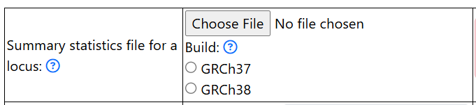
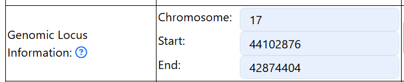

.. include:: docs/source/qtl/prepare_input_files.rst

Quick start
===========

To run a successful QTLs analysis on FUMA, follow the following steps: 

1. Upload input file
--------------------
- Upload the input file for **a genomic risk locus** (see :ref:`prepare_input_files`) by clicking on the `Choose File` button.
- Click on either `GRCh37` or `GRCh38` to select the genome build of your input GWAS summary statistics

2. Add information on the genomic locus
---------------------------------------
- Enter the chromosome, start, and end position of the genomic risk locus. 
- Please use the same values as you used for preparing the input file.
- Example: 

3. Select colocalization (if desired)
------------------------------------
- Click on the button in the `Perform colocalization` section to select colocalization and update parameters if needed. 

.. image::colocalization.png
   :width: 600

4. Select LAVA (if desired)
- Click on the button in the `Perform LAVA` section to select LAVA and update parameters if needed. 

.. image::lava.png
   :width: 600

5. Other parameters
- Fill in the number of cases
    - Put in `NA` if your trait is a continuous trait
- Fill in the total number of sample size

.. image::other_params.png
   :width: 600

6. Select datasets
- QTLs datasets are organized by types and name of datasets. Click on the name of the datasets to select. 

.. image::qtls_datasets.png
   :width: 600