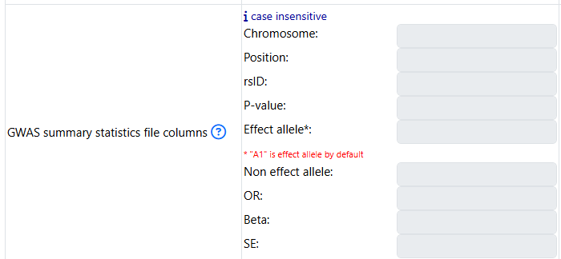

SNP2GENE
========

.. _prepare_input_file:

Prepare Input Files
-------------------

1. GWAS summary statistics
++++++++++++++++++++++++++

Overview
^^^^^^^^

- GWAS summary statistics (GWAS sumstat) is a mandatory input of SNP2GENE module. 
- FUMA accepts various types of format. For example, PLINK, SNPTEST, and METAL output formats can be used as is. 
- Otherwise, the input GWAS sumstat has to have these columns (more information in the :ref:`mandatory_columns` section):
   - chromosome, position (in hg19), and p values OR
   - rsID and p values
- Every row should contain information for one SNP. 
- An input GWAS sumstat could contain only subset of SNPs (e.g. SNPs of interest for your study to annotate them), but in this case, results of MAGMA will not be relevant anymore.
- Please note that variants that do not exist in the selected reference panel will not be included in any analyses. The 1000G reference panel is provided in the Download page (scroll to the section Reference panel data).
- Prepare input GWAS sumstat in ascii txt.  
- Before submitting, gzip your file: 

.. code-block:: console
   gzip {gwas/sum/stat}

- Below are some more specific information to help with preparing the input GWAS sumstat

Genome Build
^^^^^^^^^^^^
The reference data used by FUMA is on build GRCh37 (hg19).
If your data is build GRCh37, you can upload your file.
If your data is build GRCh38, you can: 
   - use UCSC liftover tool to lift over from GRCh38 to GRCh37
   - if your input GWAS sumstat file contains rsID, you can still submit to FUMA by first make sure that chromosome and position columns are not present. 
      - in this case, FUMA will use the provided rsID to look up the chromosomes and positions using dbSNP

.. _mandatory_columns:
Mandatory columns
^^^^^^^^^^^^^^^^^
- The input GWAS sumstat must include:
   - a column for the p values, a column for the chromosome, and a column for the position OR
   - a column for the p values and a column for the rsID
- The chromosome column can be a string such as "chr1" or just an integer such as "1". When "chr" is attached, this will be removed in output files. 
- Chromosome X can be encoded as chrX, X, chr23, or 23
   - when chrX or X is used, it will be updated to 23.
- Position has to be integer (and not in scientific notation)

Allele columns
^^^^^^^^^^^^^^
- Alleles are not mandatory but if only one allele is provided, that is considered to be the effect allele. 
- When two alleles are provided, the effect allele will be defined depending on column name. 
- If alleles are not provided, they will be extracted from the dbSNP build 146 and minor alleles will be assumed to be the effect alleles. 
- Effect and non-effect alleles are not distinguished during annotations, but used for alignment with eQTLs. 
- Whenever alleles are provided, they are matched with dbSNP build 146 if extraction of rsID, chromosome or position is necessary.
- Alleles are case insensitive.

Headers
^^^^^^^
- A header is mandatory
- Users have an option to specify the column names of the input GWAS sumstat: 

Column names are automatically detected based on the following headers (case insensitive).

SNP | snpid | markername | rsID: rsID
CHR | chromosome | chrom: chromosome
BP | pos | position: genomic position (hg19)
A1 | effect_allele | allele1 | alleleB: affected allele
A2 | non_effect_allele | allele2 | alleleA: another allele
P | pvalue | p-value | p_value | pval: P-value (Mandatory)
OR: Odds Ratio
Beta | be: Beta
SE: Standard error
If your input file has alternative names, these can be entered in the respective input boxes when specifying the input file. Note that any columns with the name listed above but with different element need to be avoided. For example, when the column name is "SNP" but the actual element is an id such as "chr:position" rather than rsID will cause an error.
Extra columns will be ignored.
Rows that start with "#" will be ignored.
 Column "N" is described in the Parameters section.
 Be careful with the alleles header in which A1 is defined as effect allele by default. Please specify both effect and non-effect allele column to avoid mislabeling.
If wrong labels are provided for alleles, it does not affect any annotation and prioritization results. It does however affect eQTLs results (alignment of risk increasing allele of GWAS and tested allele of eQTLs). Be aware of that when you interpret results.
Delimiter
Delimiter can be any of white space including single space, multiple space and tab. Because of this, each element including column names must not include any space.

Parameters
----------
Annotation and prioritization depends on several settings, which can be adjusted if desired. The default settings will result in performing naive positional mapping which maps all independent lead SNPs and SNPs in LD to genes up to 10kb apart. It does not include eQTL mapping by default, and it also does not filter on specific functional consequences of SNPs. If for example you are interested in prioritizing genes only when they are indicated by an eQTL that is in LD with a significant lead SNP, or by exonic SNPs, then you need to adjust the parameter settings.

