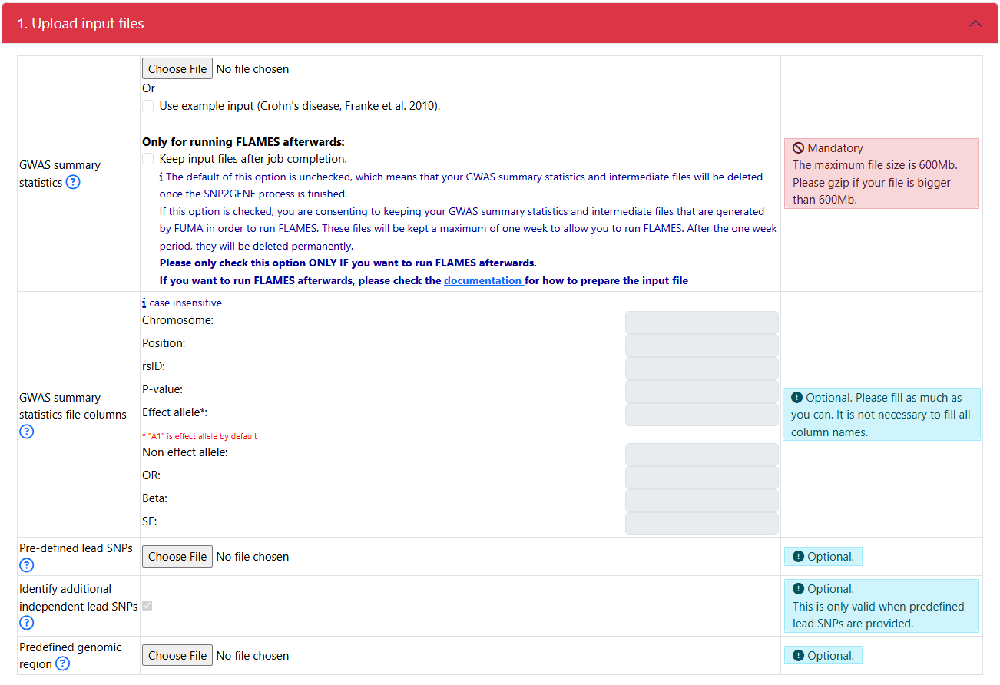
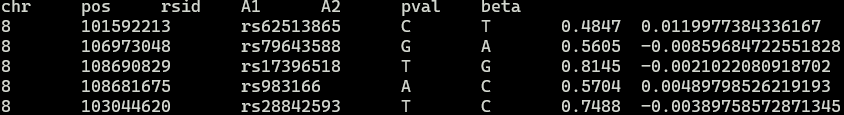
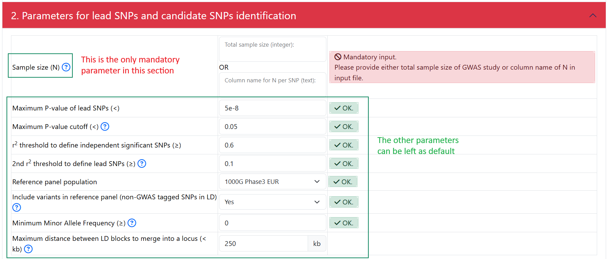
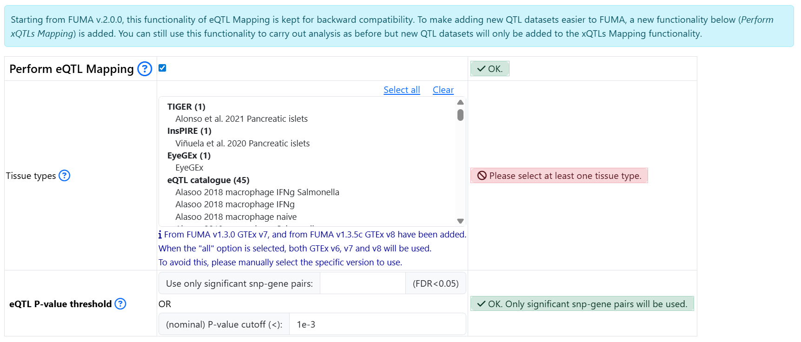
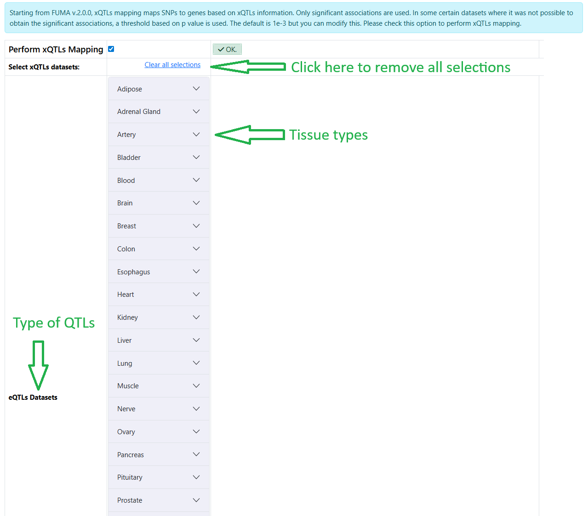
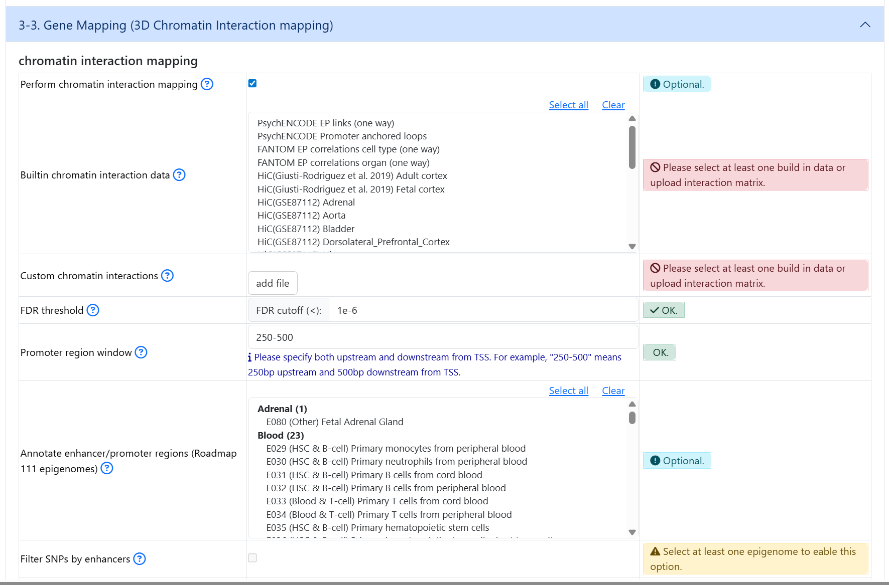
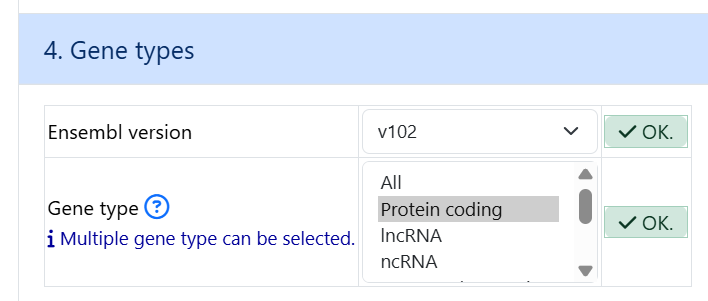
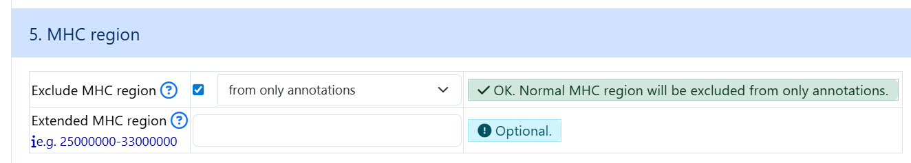
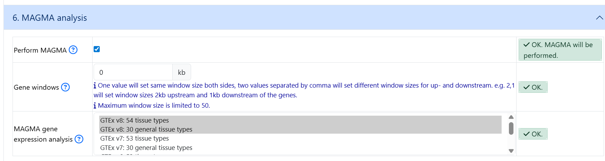

.. include:: docs/source/snp2gene/prepare_input_files.rst

Quick start
===========

To run a successful SNP2GENE job on FUMA, follow the following steps: 

1. Upload input file
--------------------

- The interphase for uploading your input file: 

Upload your GWAS summary statistics
~~~~~~~~~~~~~~~~~~~~~~~~~~~~~~~~~~~

- Click on the `Choose file` button to upload a GWAS summary statistics
    - check :ref:`gwas_sumstat` section on how to corrently prepare the input file
- Starting from FUMA v2.0, you can check the button `Keep input files after job completion.` in order to run FLAMES after a successful completion of the SNP2GENE job. 
    - The default is unchecked, which means that your uploaded input GWAS summary statistics and intermediate files producded by FUMA are removed from the FUMA server as soon as the job finishes. 
    - If this option is checked, your uploaded input GWAS summary statistics and intermediate files that are needed to run FUMA are kept for 7 days. After 7 days, they are deleted from the FUMA server. 

Specify the column names
~~~~~~~~~~~~~~~~~~~~~~~~

- Even though FUMA is capable of automatically detecting the column names of your header, only headers with specific keywords can be detected (see :ref:`headers`). Therefore, it is always recommended that you specify the column names of your header. 
- For example, this is the first few lines of an input GWAS summary statistics: 

    - Based on the header of the GWAS summary statitics, one should fill in the fields as follows: 
        - put in `chr` for `Chromosome`
        - put in `pos` for `Position`
        - put in `rsid` for `rsID`
        - put in `A1` for `Effect allele`
        - put in `A2` for `Non effect allele`
        - put in `pval` for `P-value`
        - put in `beta` for `Beta`

        .. image:: example_input_parameters.png
            :width: 600

The rest of part 1
~~~~~~~~~~~~~~~~~~
- For a simple SNP2GENE job, the rest of the options can be left as default. 

2. Parameters for lead SNPs and candidate SNPs identification
-------------------------------------------------------------
- The interphase: 

- In this section, the only mandatory parameter is the sample size (N). You can specify the sample size in 2 ways: 
    - Put in an integer represent the same size. For example: `50000` if there were 50000 individuals total (cases and controls) in your GWAS. **Do not put in 50000.0 or 50000,0**
    - If sample size is a column in your input GWAS summary statistics, you can specify the name of the column that represent the sample size. 
        - For eaxmple, if an input GWAS summary statistics looks like this:
        .. image:: example_gwas_with_samplesize.png
            :width: 600
        
        - Then, put in `N` under Column name for N per SNP: 
        .. image:: example_specify_ncol.png
            :width: 600

3. Gene mapping
---------------

3.1 Positional mapping
~~~~~~~~~~~~~~~~~~~~~~
- All the parameters can be left as default 

3.2 xQTLs mapping
~~~~~~~~~~~~~~~~~

.. note::
    In FUMA version 1, a number of eQTL datasets were available for performing eQTL mapping. This feature is now kept separately for backward compatibility. However, new data will only be added to the `Perform xQTLs Mapping` section starting from FUMA version 2. 

- The section `Perform eQTL Mapping` from FUMA version 1 is kept as is. You need to click on the button to select it and expand parameters: 

- Starting from FUMA version 2, additional different types of QTLs have been added. You need to lick on the button `Perform xQTLs Mapping` to select this option and to be able to select the datasets. 
    - The datasets are organized by types of QTLs and tissue types

3.3 3D Chromatin interaction mapping
~~~~~~~~~~~~~~~~~~~~~~~~~~~~~~~~~~~~
- If you wish to perform 3D chromatin interaction mapping, click on the button in oder to expand dataset selection and optional parameters

4. Gene types
-------------
- The default parameters can be left as is

5. MHC region
-------------
- The default parameters can be left as is

6. MAGMA analysis
-----------------

- By default, MAGMA is **not** selected. If you wish to run MAGMA, click on the `Perform MAGMA` button 

7. Enter a title 
----------------

- This part is not mandatory but it is recommended to give a title for your job so that you can refer to it later. If you do not give a title, the title will be assigned as `None`

8. Submit
---------

- After all the mandatory information is filled/uploaded, you can click on the `Submit Job` button. 