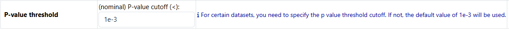
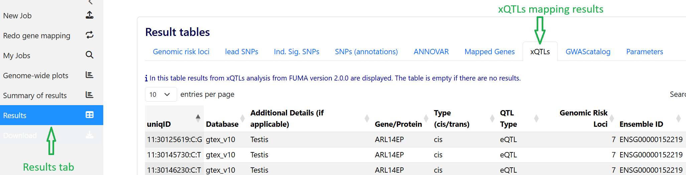
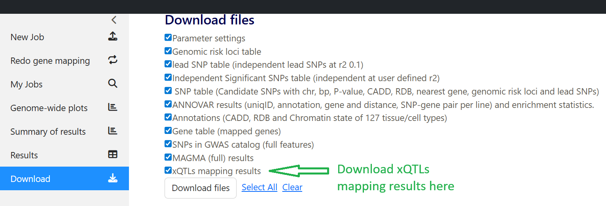
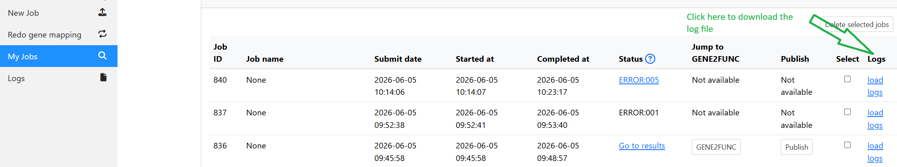
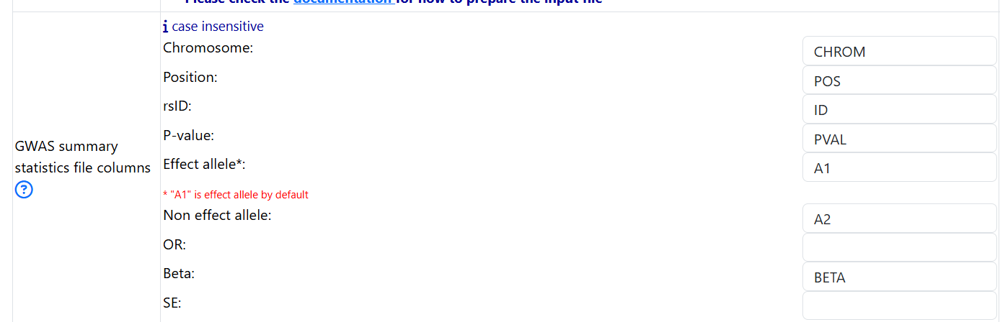

.. include:: docs/source/snp2gene/prepare_input_files.rst
.. include:: docs/source/flames/quick_start.rst

Quick start
===========

To run a successful SNP2GENE job on FUMA, follow the following steps: 

1. Upload input file
--------------------

- The interface for uploading your input file: 

.. image:: part1_upload_input_file.png
   :width: 800

If your GWAS sumstat is in GRCh37
^^^^^^^^^^^^^^^^^^^^^^^^^^^^^^^^^

Upload your GWAS summary statistics
~~~~~~~~~~~~~~~~~~~~~~~~~~~~~~~~~~~

- Click on the `Choose file` button to upload a GWAS summary statistics
    - check :ref:`gwas_sumstat_37` section on how to correctly prepare the input file
- Starting from FUMA v2.0.0, you can check the button `Keep input files after job completion.` in order to run FLAMES after a successful completion of the SNP2GENE job. 
    - The default is unchecked, which means that your uploaded input GWAS summary statistics and intermediate files producded by FUMA are removed from the FUMA server as soon as the job finishes. 
    - If this option is checked, your uploaded input GWAS summary statistics and intermediate files that are needed to run FUMA are kept for 7 days. After 7 days, they are deleted from the FUMA server. 
    - **IMPORTANT**: If you just want to run a SNP2GENE job, please leave this option unchecked. You should **ONLY** check this option if you want to run the FLAMES module within 7 days. If you check this option, make sure to follow :ref:`submit_snp2gene_for_flames` to properly prepare the GWAS summary statistics. Otherwise, FLAMES would fail. 

Specify the column names
~~~~~~~~~~~~~~~~~~~~~~~~

- Even though FUMA is capable of automatically detecting the column names of your header, only headers with specific keywords can be detected (see :ref:`headers`). Therefore, it is always recommended that you specify the column names of your header. 
- For example, this is the first few lines of an input GWAS summary statistics: 

.. image:: example_gwas_sumstat.png
   :width: 800

- Based on the header of the GWAS summary statitics, one should fill in the fields as follows: 
    - put in `chr` for `Chromosome`
    - put in `pos` for `Position`
    - put in `rsid` for `rsID`
    - put in `A1` for `Effect allele`
    - put in `A2` for `Non effect allele`
    - put in `pval` for `P-value`
    - put in `beta` for `Beta`

    .. image:: example_input_parameters.png
        :width: 600

If your GWAS sumstat is in GRCh38
^^^^^^^^^^^^^^^^^^^^^^^^^^^^^^^^^

Upload your GWAS summary statistics
~~~~~~~~~~~~~~~~~~~~~~~~~~~~~~~~~~~

- Click on the `Choose file` button to upload a GWAS summary statistics
    - check :ref:`gwas_sumstat_38` section on how to corrently prepare the input file

- Click on the `Input file is in GRCh38.` button to indicate that your file is in GRCh38

Specify the column names
~~~~~~~~~~~~~~~~~~~~~~~~

- DO NOT FILL IN THIS PART

The rest of part 1
^^^^^^^^^^^^^^^^^^
- For a simple SNP2GENE job, the rest of the options can be left as default. 

2. Parameters for lead SNPs and candidate SNPs identification
-------------------------------------------------------------
- The interphase: 
.. image:: part2.png
   :width: 800
- In this section, the only mandatory parameter is the sample size (N). You can specify the sample size in 2 ways: 
    - Put in an integer represent the same size. For example: `50000` if there were 50000 individuals total (cases and controls) in your GWAS. **Do not put in 50000.0 or 50000,0**
    - If sample size is a column in your input GWAS summary statistics, you can specify the name of the column that represent the sample size. 
        - For eaxmple, if an input GWAS summary statistics looks like this:
        .. image:: example_gwas_with_samplesize.png
            :width: 600
        
        - Then, put in `N` under Column name for N per SNP: 
        .. image:: example_specify_ncol.png
            :width: 600

3. Gene mapping
---------------

3.1 Positional mapping
~~~~~~~~~~~~~~~~~~~~~~
- All the parameters can be left as default 

3.2 xQTLs mapping
~~~~~~~~~~~~~~~~~

.. note::
    In FUMA version 1, a number of eQTL datasets were available for performing eQTL mapping. This feature is now kept separately for backward compatibility. However, new data will only be added to the `Perform xQTLs Mapping` section starting from FUMA version 2. 

- The section `Perform eQTL Mapping` from FUMA version 1 is kept as is. You need to click on the button to select it and expand parameters: 
.. image:: fuma1_perform_eqtl_mapping.png
    :width: 800

- Starting from FUMA version 2, additional different types of QTLs have been added. You need to click on the button `Perform xQTLs Mapping` to select this option and to be able to select the datasets. 
    - The datasets are organized by types of QTLs and tissue types

.. image:: xqtls_mapping_options.png
    :width: 800

.. warning::
    The xQTLs mapping functionality only exists in the new submission of SNP2GENE job and does not (yet) exist in the redoing gene mapping. If you wish to redo gene mapping, you can submit a new SNP2GENE job. 

- List of datasets available for FUMA v2.0.0:

+----------+--------------------------------------------+-----------------------+
| QTL type | Datasets                                   | Notes                 |
+==========+============================================+=======================+
| eQTL     | GTEx v10                                   |                       |
+----------+--------------------------------------------+-----------------------+
| eQTL     | Metabrain                                  |                       |
+----------+--------------------------------------------+-----------------------+
| sQTL     | GTEx v10                                   |                       | 
+----------+--------------------------------------------+-----------------------+
| pQTL     | Suhre et al. (Nat. Comm., 2017)            |                       |
+----------+--------------------------------------------+-----------------------+
| pQTL     | Sun et al. (PLoS Genetics, 2016)           |                       |
+----------+--------------------------------------------+-----------------------+
| pQTL     | Gudjonsson et al. (Nat. Comm., 2022)       |                       |
+----------+--------------------------------------------+-----------------------+
| pQTL     | Sun et al. (Nature, 2018)                  |                       |
+----------+--------------------------------------------+-----------------------+
| pQTL     | Emilsson et al. (Nat. Comm. 2022)          |                       |
+----------+--------------------------------------------+-----------------------+
| pQTL     | Katz et al. (Circulation, 2021)            |                       |
+----------+--------------------------------------------+-----------------------+
| pQTL     | Ferkingstad et al. (Nature Genetics, 2021) |                       |
+----------+--------------------------------------------+-----------------------+
| pQTL     | Pietzner et al. (Science, 2021)            |                       |
+----------+--------------------------------------------+-----------------------+
| pQTL     | Sun et al. (Nature 2023)                   |                       |
+----------+--------------------------------------------+-----------------------+
| pQTL     | Carland et al. (Clin. Proteom. 2023)       |                       |
+----------+--------------------------------------------+-----------------------+
| pQTL     | Niu et al. Nat Genet (2025)                |                       |
+----------+--------------------------------------------+-----------------------+
| pQTL     | Yang et al. (Nature Neuroscience, 2021)    |                       |
+----------+--------------------------------------------+-----------------------+
| sceQTL   | bryois2022Brain                            | p threshold is needed |
+----------+--------------------------------------------+-----------------------+
| sceQTL   | jerber2021Dopaminergic                     | p threshold is needed |
+----------+--------------------------------------------+-----------------------+
| sceQTL   | SingleBrain                                |                       |
+----------+--------------------------------------------+-----------------------+
| sceQTL   | Brainscope                                 |                       |
+----------+--------------------------------------------+-----------------------+

- In two of the datasets noted with p threshold is needed (`bryois2022Brain` and `jerber2021Dopaminergic`), what this means is that in these two studies, only full summary statistics were found and not the significant variant-gene/protein pairs defined by the original studies. Therefore, for these 2 datasets, a threshold is used to define significant variant-gene/protein pair. The default is set to a nominal p value cutoff of 1e-3 but you can change this: 

- The outputs of the xQTLs mapping analysis can be found under the `Results` tab:

- The outputs of xQTLs mapping analysis can be downloaded under the `Download` tab:

3.3 3D Chromatin interaction mapping
~~~~~~~~~~~~~~~~~~~~~~~~~~~~~~~~~~~~
- If you wish to perform 3D chromatin interaction mapping, click on the button in oder to expand dataset selection and optional parameters

.. image:: chromatin_mapping.png
    :width: 800

4. Gene types
-------------
- The default parameters can be left as is

.. image:: part4_gene_types.png
    :width: 800

5. MHC region
-------------
- The default parameters can be left as is

.. image:: part5_mhc.png
    :width: 800

6. MAGMA analysis
-----------------

- By default, MAGMA is **not** selected. If you wish to run MAGMA, click on the `Perform MAGMA` button 

.. image:: part6_magma.png
    :width: 800

7. Enter a title 
----------------

- This part is not mandatory but it is recommended to give a title for your job so that you can refer to it later. If you do not give a title, the title will be assigned as `None`

8. Submit
---------

- After all the mandatory information is filled/uploaded, you can click on the `Submit Job` button. 

9. View log file
----------------

- You can download the log file of each job (only for jobs created after FUMA version 2.1.0)
- Note that the log file currently logs the processing of the GWAS sumstat file. Additional log will be added in future release. 

10. Examples of GWAS sumstat for SNP2GENE
-----------------------------------------

GRCh37
^^^^^^

Example 1. All 6 columns are present
~~~~~~~~~~~~~~~~~~~~~~~~~~~~~~~~~~~~
- 6 columns are present: chromosome, position, effect allele, non effect allele, rsID, and pval

.. code-block:: bash

    CHROM   ID      POS     A1      A2      BETA    PVAL
    21      rs148082907     16647205        T       C       -0.0638027918527484     0.06351
    21      rs2823892       17948888        T       A       0.0125015292229252      0.5092
    21      rs76775116      15453489        G       A       0.0176041339483571      0.5157
    21      rs2747364       14769046        A       G       -0.00359645951440505    0.7272
    21      rs2823451       17060281        T       A       -0.0139975096438537     0.1752

- Specify the names of the columns 

Example 2. Only rsID is missing
~~~~~~~~~~~~~~~~~~~~~~~~~~~~~~~

.. code-block:: bash

    CHROM   POS     A1      A2      BETA    PVAL
    21      16647205        T       C       -0.0638027918527484     0.06351
    21      17948888        T       A       0.0125015292229252      0.5092
    21      15453489        G       A       0.0176041339483571      0.5157
    21      14769046        A       G       -0.00359645951440505    0.7272
    21      17060281        T       A       -0.0139975096438537     0.1752

- FUMA looks up rsID from the reference panel for the select population. If rsID is not found, ID is chr:pos:A1:A2

Example 3. When either effect allele or non effect allele or both are missing
~~~~~~~~~~~~~~~~~~~~~~~~~~~~~~~~~~~~~~~~~~~~~~~~~~~~~~~~~~~~~~~~~~~~~~~~~~~~~

.. code-block:: bash

    CHROM   POS     A1      BETA    PVAL
    21      16647205        T       -0.0638027918527484     0.06351
    21      17948888        T       0.0125015292229252      0.5092
    21      15453489        G       0.0176041339483571      0.5157
    21      14769046        A       -0.00359645951440505    0.7272
    21      17060281        T       -0.0139975096438537     0.1752

- FUMA looks up rsID from the reference panel for the select population. Check the log files to see which variants are dropped. 

Example 3. Chromosome and Position are missing
~~~~~~~~~~~~~~~~~~~~~~~~~~~~~~~~~~~~~~~~~~~~~~

.. code-block:: bash

    ID      BETA    PVAL
    rs148082907     -0.0638027918527484     0.06351
    rs2823892       0.0125015292229252      0.5092
    rs76775116      0.0176041339483571      0.5157
    rs2747364       -0.00359645951440505    0.7272
    rs2823451       -0.0139975096438537     0.1752

- FUMA looks up chromosome, position, effect allele, and non effect allele if needed from dbSNP version 146. 

GRCh38
^^^^^^

Example 1. 3 colums
~~~~~~~~~~~~~~~~~~~

.. code-block:: bash

    chromosome      base_pair_location      p_value
    21      13086116        0.3811
    21      13143418        0.3467
    21      13226318        0.1995
    21      13226514        0.198
    21      13228955        0.1008

Example 2. 6 colums
~~~~~~~~~~~~~~~~~~~

.. code-block:: bash
    
    chromosome      base_pair_location      effect_allele   other_allele    beta    p_value
    21      13086116        T       C       -0.1844 0.3811
    21      13143418        T       C       0.1984  0.3467
    21      13226318        T       G       0.203   0.1995
    21      13226514        A       G       0.2038  0.198
    21      13228955        T       TG      -0.4733 0.1008